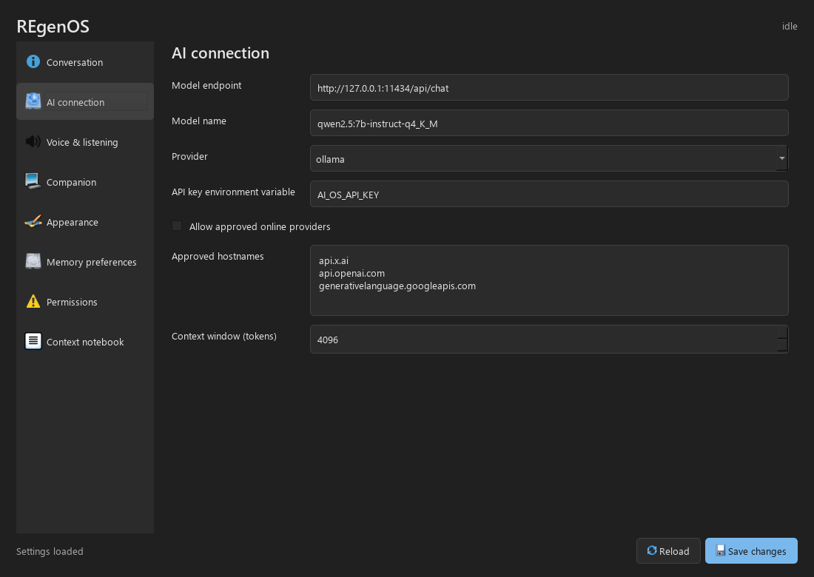

# C++ REgenOS Hub

The default settings entry point now launches `regenos-hub`, a compiled
C++17/Qt 6 Widgets application in `native/hub/`. It does not embed Python,
HTML, JavaScript, WebEngine or a browser. Python remains the AI/voice/memory
backend and animated companion implementation. The previous Python settings
window remains in source for regression coverage, not as the shipped launcher.



## Upgrade On Arch

Keep Ollama, its models, the current venv and runtime configuration. Review
`git status` and back up runtime data before upgrading. These commands build
the app on Arch rather than copying a Windows executable:

```bash
cd ~/src/ai-os
git status
git pull --ff-only
sudo pacman -Syu
bash install/ai-os-install.sh native
~/.ai_os/venv/bin/regenos-settings
```

The native stage installs the C++ compiler/CMake/Ninja, Qt 6 Widgets/Wayland,
the existing Python companion and original cursor theme. No models are
downloaded or replaced. For only the hub upgrade, with desktop prerequisites
already installed, run `bash scripts/install_cpp_hub.sh` instead.

The executable is `~/.ai_os/bin/regenos-hub`; the compatible `regenos-settings`
entry point supplies the correct venv Python interpreter. Super+A and the
application launcher continue to work. If you use a different `AI_OS_HOME`,
export it consistently for the installer, daemon and hub.

New configurations use Graphite: charcoal surfaces, soft borders, regular
contrast and a restrained blue accent. This does not enable Windows/Linux
high-contrast accessibility mode. Existing theme preferences are preserved;
select Graphite in Appearance to change an older installation. Third-party
applications and the complete Linux desktop are not forcibly recolored.

## Connected Controls

- AI: local Ollama or compatible server, model, endpoint, context size,
  approved remote hosts and environment-variable API key name. Keys are not
  stored in settings. The hub inherits your desktop environment, which may
  differ from the daemon's systemd secrets environment.
- Conversation: send a message, inspect tool results, load recent history,
  and optionally speak replies. Privileged/destructive actions are denied
  because the backend has no interactive terminal. Ordinary tool responses
  are displayed as structured results; an autonomous planning loop is pending.
- Voice: Piper and Whisper paths, custom wake-word model, threshold,
  recording duration, speech switch, voice duration multiplier, test voice,
  and listener service controls. Save and restart the listener after changes.
  A multiplier above 1 speaks more slowly; below 1 speaks faster.
- Companion: visibility, shape, color swatch, corner, scale, animation,
  motion, response strength and six emotion baselines with live state bars.
- Appearance: product/assistant identity, logo, wallpaper, lock screen,
  icon/cursor/font preferences, with explicit desktop-application confirmation.
- Memory: opt-out, retention, recent conversation loading/clearing, and a
  context notebook with editable/importable/exportable notes.
- Permissions: protected-setting confirmations and Hyprland tool opt-in.

Custom wake words require an existing trained `.onnx` or `.tflite` model and
openWakeWord's locally provisioned feature models. Selecting a file does not
train a new phrase. OpenWakeWord/Piper/Whisper model downloads remain a separate
setup step. Hub service controls use the existing `ai-os.service` user unit.

## Memory And Privacy

New conversation history and notes live in
`~/.ai_os/data/private/conversations.sqlite3`. Unix directory/database modes
are 0700/0600. This is local plaintext, not encryption. SQLite transactions
handle concurrent readers/writers and `secure_delete` is enabled, but deletion
is not a promise of forensic erasure on an SSD or in backups.

Up to 2000 turns are retained globally, with a configurable 1-365-day policy
applied when history is read or written. A model request uses a bounded recent
window and up to three matching notes, constrained by a character budget.
Notes are explicitly curated, limited to 256 entries and 8192 characters each.
This is lexical retrieval, not semantic Chroma retrieval or model training.
Unrelated old facts may not be recalled. Notes remain until explicitly deleted.

Disabling memory stops history storage and retrieval into new requests. It does
not delete previously stored data. Clearing conversations leaves notes intact.
Old `data/events.jsonl` files from earlier releases are not imported or erased;
review/delete those separately if desired. New replies are no longer duplicated
into that legacy event log. Other system-tool events may still be logged.

When you deliberately enable an online provider, the included recent history
and matching notes are sent with your prompt to that provider. Do not put
passwords or API keys into context notes. Automatic sensitive-data filtering
is not implemented. Exports are private user data and must not be committed.

## Boundary And Tests

Qt's asynchronous `QProcess` invokes `python -m ai_os.hub_bridge` through
private stdin/stdout pipes with bounded requests, response sizes and timeouts.
There is no TCP listener. The schema and validators stay in Python; the UI
does not maintain a conflicting second list of supported settings. Stale
settings snapshots are rejected before saving. Single-instance Qt local IPC
raises the existing hub window.

These processes share one OS user. Dialog confirmations and revision checks
are not protection against a malicious same-user process, nor full daemon/UI
trust separation. Do not expose the bridge as an unrestricted network service.

```bash
cd ~/src/ai-os
~/.ai_os/venv/bin/python -m pip install -e '.[desktop,dev]'
~/.ai_os/venv/bin/python -m pytest -q
QT_QPA_PLATFORM=offscreen REGENOS_TEST_PYTHON="$HOME/.ai_os/venv/bin/python" \
  ctest --test-dir build/hub-linux --output-on-failure
```

Windows verification includes a real C++ build, widget tests, real bridge
load/save, Python tests, and screenshots at 1100x780 and 780x620. No claim of
Arch audio, NVIDIA or systemd validation follows from those tests.

On Arch, verify: two-turn recall; restart-and-recall; memory disable; forgetting;
note matching; voice sample-rate playback; chosen wake word; stopping/starting
the listener; visible companion state; and denied background destructive
requests. Monitor `nvidia-smi` while exercising models. A context-size setting
does not enforce a VRAM ceiling; do not increase it blindly on the 8 GB GPU.
